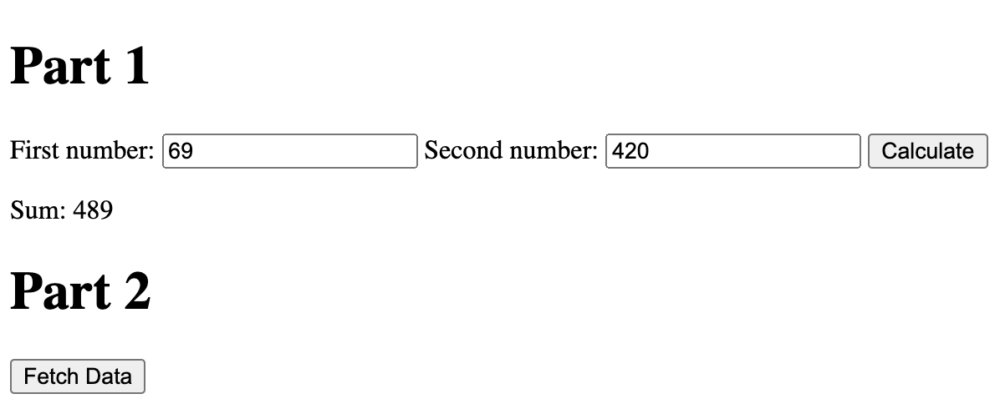

# DevTools - Debugging
### Full Screenshot

### Breakpoint List Screenshot

### Watch Expressions List Screenshot

1. The bug was that when num1 and num2 were being retrieved by the document.getElementbyId() snippet, they were being converted to strings. Hence, when they went into the function "calculateSum" to be added together, they were being concatenated because they were both of type string. Therefore, the result would just be a string of the first number concatenated with the second, instead of the actual sum.
2. In order to fix this issue, an explicit type cast to "Number" was needed when the variables were being retrieved. In my fixed code, the variables are now taken in as Numbers so that when they enter the "calculateSum" function, "result" will simply be the addition of two Numbers which results in the actual sum. Additionally, the data type of "result" would now be "Number."
### Fixed File Screenshot

### Fixed Example Screenshot
 

# DevTools - Network Tab
3. citylots.json
4. part2.js
5. 11.7 MB
6. 89 ms
7. User-Agent: Mozilla/5.0 (Macintosh; Intel Mac OS X 10_15_7) AppleWebKit/537.36 (KHTML, like Gecko) Chrome/90.0.4430.85 Safari/537.36
8. Server: Apache
9. Last-Modified: Tue, 26 Jan 2021 22:14:13 GMT
10. Content-Type: application/json
11. fetchData()

